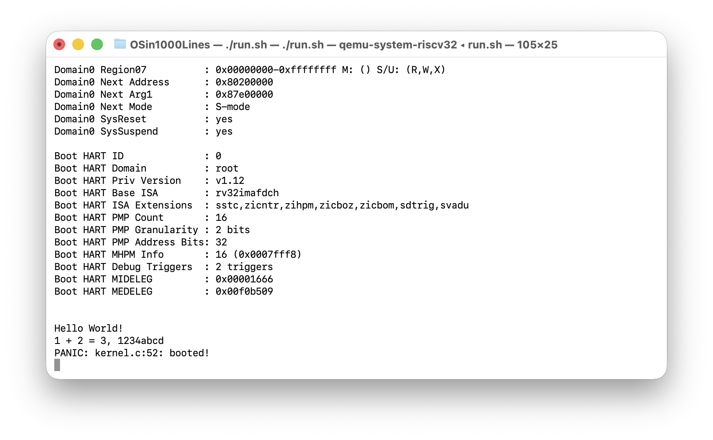

## 最终目标

实现 PANIC 宏

## 知识

`xxx; while(1){}` 使程序“停止”，包裹 `do{ }while(0)`是为了组成一个完整的语句，是安全宏的标准做法，如果直接写`xxx; while(1){}`的话是不安全的，例子如 [PRE10-C. 複数の文からなるマクロは do-while ループで包む](https://www.jpcert.or.jp/sc-rules/c-pre10-c.html)

## 具体使用

```c
void kernel_main(void) {
    //初始化__bss段
    memset(__bss, 0, (size_t) __bss_end - (size_t) __bss); 

    printf("\n\nHello %s\n", "World!");
    printf("1 + 2 = %d, %x\n", 1 + 2, 0x1234abcd);

    // const char *s = "\n\nHello World!\n";
    // for (int i = 0; s[i] != '\0'; i++) {
    //     putchar(s[i]);
    // }

    PANIC("booted!");
    printf("unreachable here!\n");

    for(;;) {//keep in this function
        __asm__ __volatile__("wfi");
    }
}
```

