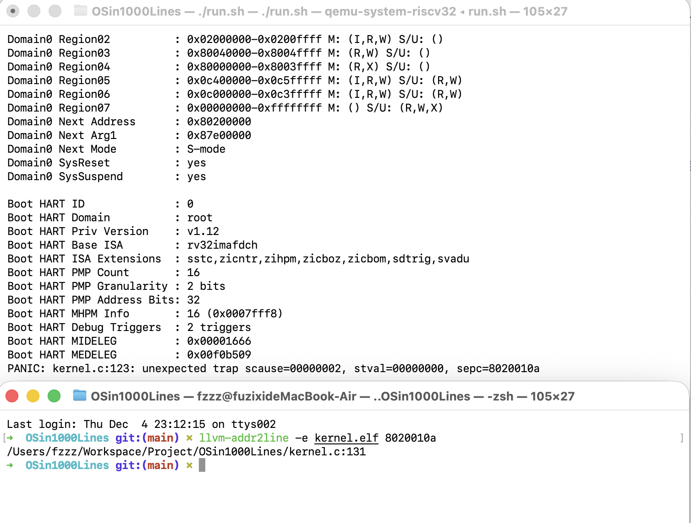

## 最终目标

处理异常，触发到异常后跳转到 stvec 寄存器，进入异常入口，保存当前CPU状态，并可以恢复CPU状态

## 知识

1. 复习：S-Mode(Supervisor Mode 内核级) | M-Mode(Machine Mode 硬件级) | U-Mode(User Mode 用户级)
2. 复习 `lw = load word` `sw = store word`, 疑问: 不就是写入的顺序反了吗? 解答: store 和 load 表示的是写入的逻辑，比如 load 指的是 load 到寄存器中，store 指的是 store 到内存中，加载到寄存器中和保存到内存中的区别

CSR 操作变体，需要记住的是`CSRRW = read old CSR, then write new CSR`他们都是围着 CSR 转的，以 CSR 为中心
1. `CSRRW rd,csr,rs` 将 csr 的值写入 rd，再将 rs 赋值给将 csr  `rd = csr \ csr = rs` 就是 CSR RW（Read-Write）
2. `CSRRS rd csr rs` 将 csr 的值写入 rd，再将 csr 按 rs `1` 的位置置 `1` 即 `rd =csr \ csr | rs` 就是 CSR RS (Read-Setbits) 
3. `CSRRC rd csr rs` 将 csr 的值写入 rd，再将 csr 按 rs `1` 的位置置 `0` 即 `rd =csr \ csr & (~rs)` 就是 CSR RC (Read-Clearbits) 
4. 在代码中 `"sw t0,  4 * 3(sp)\n"` 将t0的值存储在4 * 3(sp)上，但是，为什么是乘法？而不是加法(sp + 4 * 3)？答案是RISC-V 汇编的立即数格式不允许写 sp + something, 语法固定这样写：必须是 offset(基址寄存器)。
5. 栈帧是指保存了当前的栈顶指针，然后下压31个寄存器，
6.  CSR 是“控制寄存器”，只能被 CSR 指令操作，也就是我所困惑的地方` csrr a0, sscratch \ sw a0, 4 * 30(sp)`为什么不能写成 `csrr sscratch, 4*30(sp) 或 sw sscratch, 4*30(sp)`呢，原因就是因为 RISC-V 的 CSR 指令不能直接参与内存访存，RISC-V 把 CSR 视为“特殊寄存器”，它们不能参与普通寄存器的三元运算模式。

```c
#define READ_CSR(reg)                                                          \
    ({                                                                         \
        unsigned long __tmp;                                                   \
        __asm__ __volatile__("csrr %0, " #reg : "=r"(__tmp));                  \
        __tmp;                                                                 \
    })

READ_CSR(sstatus);
```
第一步先将 #reg 字符串化，变成 "csrr %0 sstatus" : "=r"(__tmp)

第二步由编译器选择一个寄存器(假如是 a0),那么依照"=r 输出操作数（被用作输出的寄存器，也即「输出寄存器」）"，将(__tmp)输出到编译器分配到寄存器a0中,那么变成 "csrr a0, sstatus"

至于为什么不直接用 `__tmp`？因为 __tmp 是C语言变量，不能用到汇编中

举一反三一波

```c
#define WRITE_CSR(reg, value)                                                  \
    do {                                                                       \
        uint32_t __tmp = (value);                                              \
        __asm__ __volatile__("csrw " #reg ", %0" ::"r"(__tmp));                \
    } while (0)

WRITE_CSR(stvec, (uint32_t) kernel_entry);
```

第一步先将 #reg 字符串化，变成 "csrw stvec",%0 : : "r"(__tmp)

第二步由编译器选择一个寄存器(假如是 a1),那么依照"r 输入操作数（被用作输入的寄存器，也即「输入寄存器」）"，将(__tmp)输入到编译器分配到寄存器a1中,那么变成 "csrw stvec, a1"



最后的 call 函数调用，参数 *f 是 a0，因为 a0-a7 中，a0 就是第一个输入的参数，绑定到 a0 上